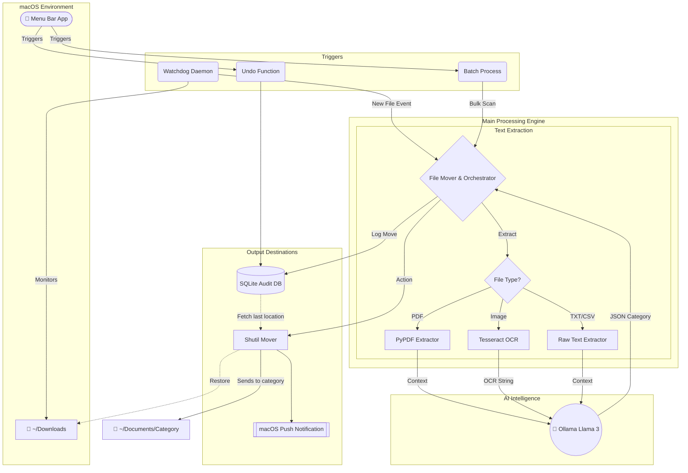

# 🏗️ AI File Organizer Architecture

Below is the complete system architecture mapping out how the components interact in your macOS environment.

## How It Flows
1. Everything begins either with the **Watchdog Daemon** actively catching a new file or the user manually triggering a **Sweep** via the **Menu Bar UI**.
2. The orchestrator isolates the file and hands it off to your local extraction engines (`Tesseract`, `PyPDF`) to scrape text context safely.
3. The raw string context is packaged with the original filename and dispatched to the local **Ollama AI**.
4. Ollama replies with a structured JSON identifying the `Category` while automatically wiping the prompt from its Active Memory to preserve efficiency.
5. The orchestrated script fires a success **macOS Push Notification**, logs the absolute origin paths into the **SQLite History Database**, and physically transports the file using python's `shutil` library!
